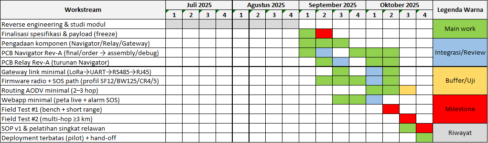

# Roadmap Jul–Okt 2025 (Weekly Blocks)

**Legenda:** 🟩 kerja utama · 🟦 integrasi/review · 🟨 buffer/uji · 🟥 milestone · ⬜️ kosong · 🟪 riwayat

### September 2025
| Workstream | 1–7 | 8–14 | 15–21 | 22–28 | 29–30 |
|---|---|---|---|---|---|
| Freeze spesifikasi/payload | 🟩 | 🟥 | ⬜️ | ⬜️ | ⬜️ |
| Pengadaan komponen | 🟩 | 🟩 | 🟩 | ⬜️ | ⬜️ |
| PCB Navigator Rev-A | 🟩 finalize | 🟦 order/review | ⬜️ | 🟩 assembly | ⬜️ |
| PCB Relay Rev-A | ⬜️ | 🟩 finalize | 🟩 order | ⬜️ | ⬜️ |
| Webapp minimal (peta+SOS) | ⬜️ | ⬜️ | 🟩 | 🟦 | ⬜️ |
| Firmware radio+SOS | ⬜️ | 🟩 | 🟩 | 🟩 | ⬜️ |

### Oktober 2025
| Workstream | 1–5 | 6–12 | 13–19 | 20–26 | 27–31 |
|---|---|---|---|---|
| Bring-up & debug (Nav/Relay) | 🟦 | 🟩 | ⬜️ | ⬜️ | ⬜️ |
| Routing AODV minimal (2–3 hop) | 🟩 | 🟩 | 🟨 | ⬜️ | ⬜️ |
| Gateway link minimal (LoRa→RS485) | 🟦 | 🟩 | 🟩 | ⬜️ | ⬜️ |
| Field Test #1 (bench/short) | ⬜️ | 🟥 | ⬜️ | ⬜️ | ⬜️ |
| Field Test #2 (≥3 km) | ⬜️ | ⬜️ | 🟥 | ⬜️ | ⬜️ |
| SOP v1 & pelatihan | ⬜️ | ⬜️ | 🟩 | 🟩 | 🟥 |
| Deployment terbatas (pilot) | ⬜️ | ⬜️ | ⬜️ | 🟩 | 🟦 hand-off |

